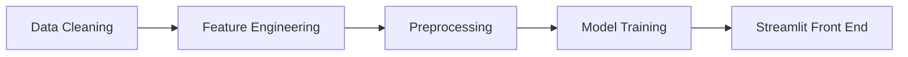

# HIFP25 - Health Insurance Fraud Project 2025
This project was developed by [Jan0341](https://github.com/Jan0341) and [Hassan-Merai](https://github.com/Hassan-Merai/).

It is a machine learning pipeline designed and deployed on AWS, using an EC2 t3.large instance and an S3 bucket for storage.

The EC2 instance was responsible for executing all processing steps, including:

# Project Modules Overview

1. `module_1_data_cleaning.ipynb` — Clean raw CSV data  
2. `module_2_feature_engineering.ipynb` — Create new features from cleaned data  
3. `module_3_merge_tables.ipynb` — Combine feature tables into one dataset  
4. `module_4_preprocessing.ipynb` — Prepare dataset for modeling (scaling, encoding, etc.)  
5. `module_5_model_training.ipynb` — Train machine learning models and save results  
6. `module_6_frontend.ipynb` — Streamlit app for visualizing results  

The main goal of the project was to build a predictive model capable of identifying potential health insurance fraud in the United States, particularly fraud committed by healthcare providers.

The entire project was implemented in Python, primarily using Dask and Pandas for data handling.
We used XGBoost as the main machine learning algorithm and Apache Airflow for workflow automation.
